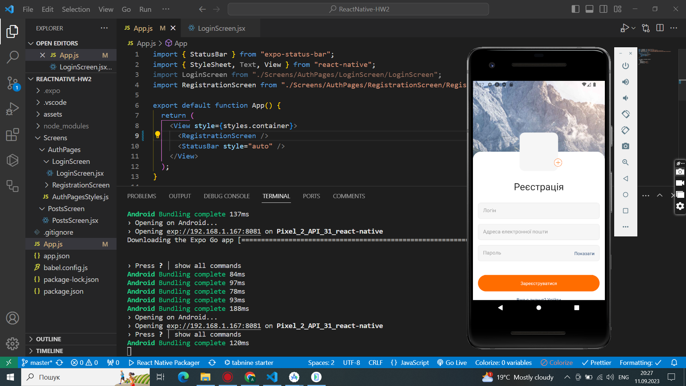
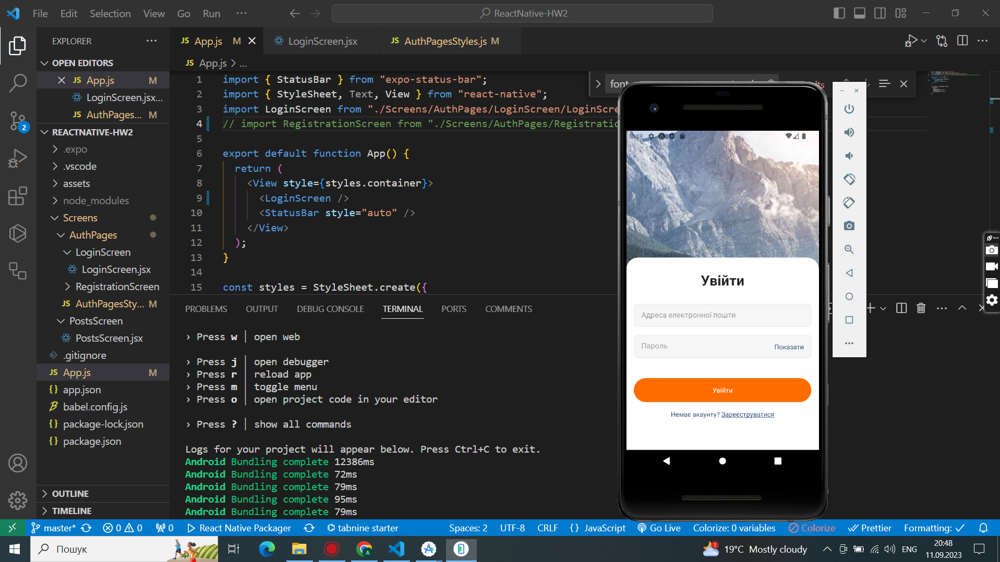
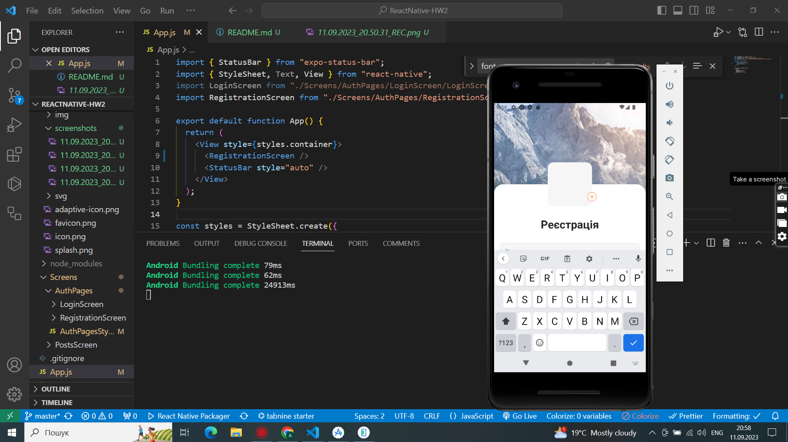
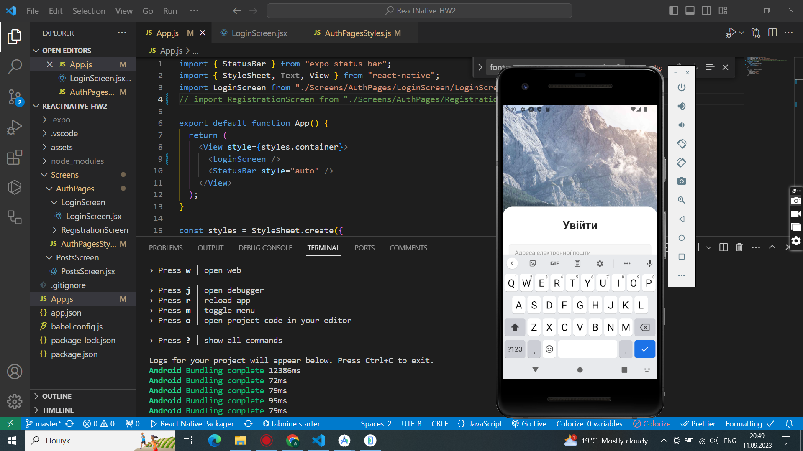

Завдання​
Створити папку Screens

Створити компонент RegistrationScreen

Створити компонент LoginScreen

Створити екран PostsScreen

Додати розмітку форми в компонент RegistrationScreen

Додати розмітку форми в компонент LoginScreen

Додати стилі до компонента RegistrationScreen

Додати стилі до компонента LoginScreen

Макет компонента RegistrationScreen

Макет компонента RegistrationScreen з відкритою клавіатурою

Макет компонента LoginScreen

Макет компонента LoginScreen з відкритою клавіатурою

Screenshots

